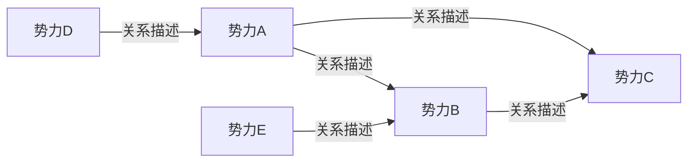

# 关系图谱模板

> 本文件用于记录全书角色关系、势力关系与关键关系演变。
> 与 `02_角色/` 下各人物档案联动：每个角色至少在关系矩阵中出现一次。
> architect Skill 设计卷纲/章纲时需避免关系冲突。

---

## 一、角色关系矩阵

> 行 = 角色 A，列 = 角色 B，单元格 = 角色 A 对角色 B 的关系描述。
> 对角线留空（自己对自己）。填入角色名后按实际关系填写。

| 角色A \ 角色B | 角色1 | 角色2 | 角色3 | 角色4 | 角色5 | 角色6 | 角色7 | 角色8 | 角色9 | 角色10 |
|---|---|---|---|---|---|---|---|---|---|---|
| 角色1 | | | | | | | | | | |
| 角色2 | | | | | | | | | | |
| 角色3 | | | | | | | | | | |
| 角色4 | | | | | | | | | | |
| 角色5 | | | | | | | | | | |
| 角色6 | | | | | | | | | | |
| 角色7 | | | | | | | | | | |
| 角色8 | | | | | | | | | | |
| 角色9 | | | | | | | | | | |
| 角色10 | | | | | | | | | | |

> 关系描述示例：父子/敌对（-60）/暗恋/师徒/利用，感情值可选填括号内。

## 二、势力关系图

> 用 mermaid graph LR 语法绘制势力关系。先填空占位符，后按实际势力填写。

**文字说明**：
- 势力A = ____（待填写，示例：萧家）
- 势力B = ____（待填写）
- 势力C = ____（待填写）
- 势力D = ____（待填写）
- 势力E = ____（待填写）
- 关系说明：____（简要描述势力间合纵连横）

## 三、关键关系详解

### 3.1 主角 × 核心女主/男主（感情线）

- **感情线类型**：____（青梅竹马/欢喜冤家/日久生情/师徒恋/...）
- **起点状态**：____（相遇时的关系）
- **关键转折节点**：
  1. ____
  2. ____
  3. ____
- **当前状态（截至ch___）**：____
- **预定结局**：____（HE/BE/开放式/待定）
- **感情线核心考验**：____（什么会威胁这段关系）

### 3.2 主角 × 导师/引路人

- **导师定位**：____（mentor，示例：药老）
- **相遇方式**：____
- **导师对主角的意义**：____
- **主角对导师的意义**：____（不能只有单向付出）
- **关系潜在冲突**：____（理念差异/秘密/利益冲突）
- **预定关系走向**：____（一直信任/反目/和解/...）

### 3.3 主角 × 核心反派

- **对立根源**：____（理念/利益/仇恨/宿命）
- **第一次交锋**：____（时间/事件/结果）
- **镜像对照点**：____（两人的相似与不同）
- **最终决战预定**：____（地点/触发条件/结局方向）

### 3.4 主角 × 核心兄弟/闺蜜

- **关系类型**：____（生死之交/损友/战友/师徒变兄弟/...）
- **结交契机**：____
- **一起经历的关键事件**：
  1. ____
  2. ____
- **关系可能破裂的点**：____（女人/理念/利益/误会）
- **预定走向**：____（一直并肩/中途分裂/和好/...）

## 四、关系演变节点（全书关键转折点）

| 节点 | 涉及人物 | 事件 | 对关系的影响 |
|---|---|---|---|
| ____ | ____ | ____ | ____ |
| ____ | ____ | ____ | ____ |
| ____ | ____ | ____ | ____ |
| ____ | ____ | ____ | ____ |
| ____ | ____ | ____ | ____ |
| ____ | ____ | ____ | ____ |
| ____ | ____ | ____ | ____ |
| ____ | ____ | ____ | ____ |

## 五、修订历史

| 日期 | 修订内容 |
|---|---|
| 2026-08-07 | 初版创建 |
